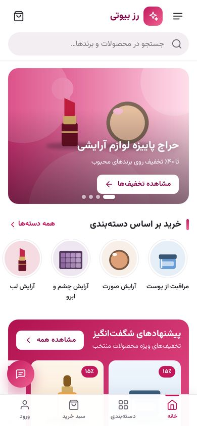
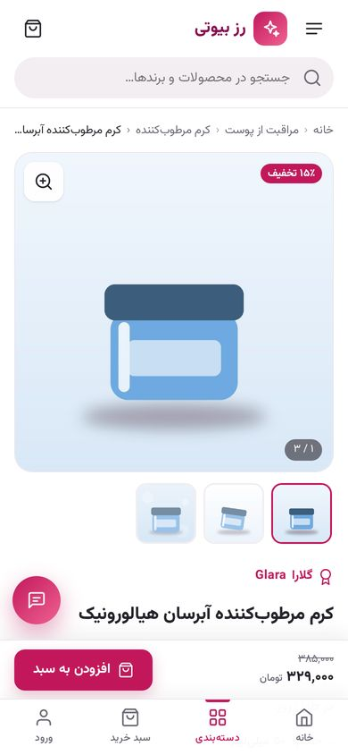
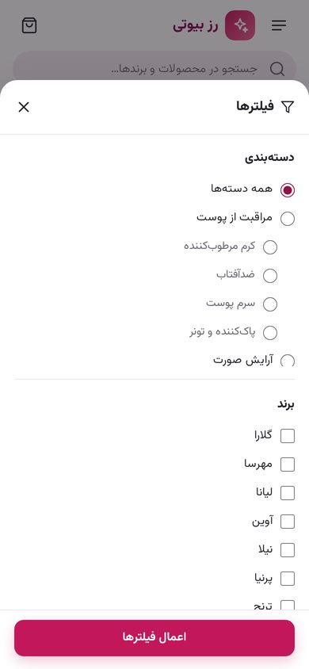
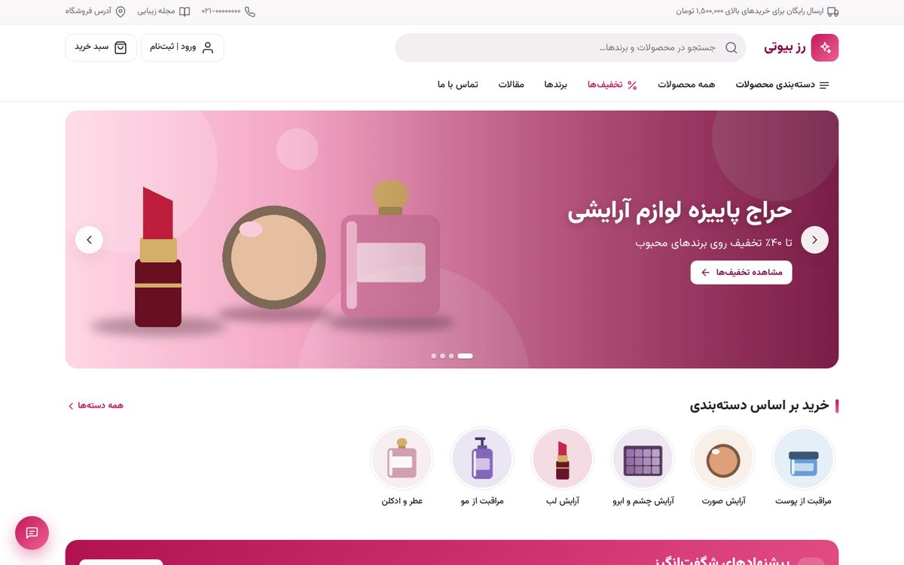
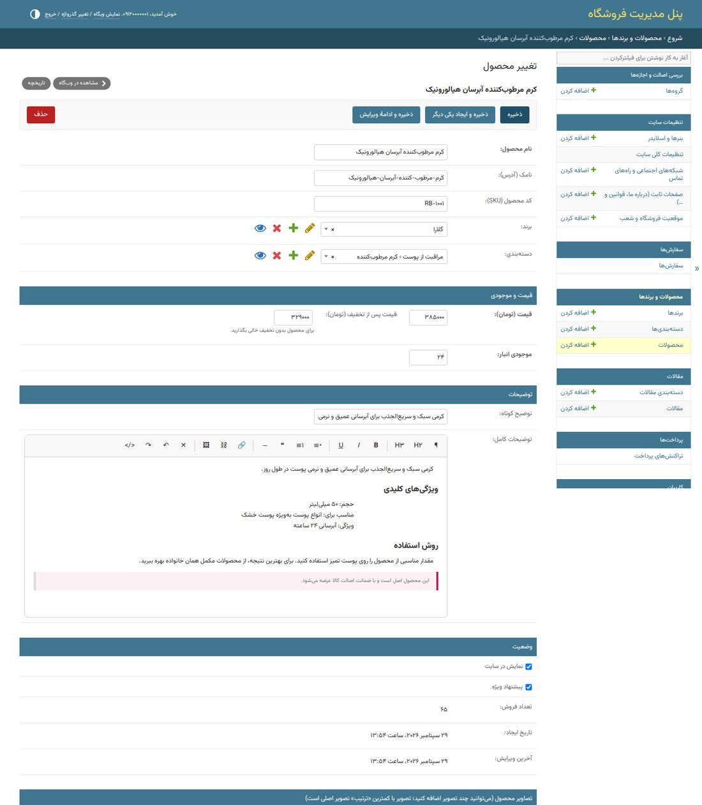

<div dir="rtl">

# فروشگاه اینترنتی لوازم آرایشی (Django)

وب‌سایت کامل فروشگاه لوازم آرایشی و بهداشتی با **HTML، CSS، JavaScript** (بدون فریم‌ورک و وابستگی سنگین) و **Django** در بک‌اند؛ کاملاً فارسی، راست‌چین و **ریسپانسیو (Mobile-first)**.

<p align="center">
  
  
  
</p>
<p align="center"></p>

## امکانات

| قابلیت درخواستی | پیاده‌سازی |
|---|---|
| ساخت صفحه پروفایل کاربری با شماره تلفن | ورود/ثبت‌نام بدون رمز عبور با **کد تایید پیامکی (OTP)**؛ حساب کاربری با اولین ورود ساخته می‌شود و کاربر به تکمیل پروفایل (نام، ایمیل، تصویر) هدایت می‌شود. پیشخوان کاربر شامل سفارش‌ها و آدرس‌ها است. |
| ویرایش نام کاربری (شماره تلفن) پس از تایید پنل پیامکی | در «تغییر شماره موبایل» کد تایید به **شماره جدید** پیامک می‌شود و فقط پس از وارد کردن کد صحیح، نام کاربری تغییر می‌کند. |
| افزودن لوکیشن مغازه | بخش «موقعیت فروشگاه و شعب» در پنل مدیریت با **انتخاب نقطه روی نقشه** (کلیک یا کشیدن نشانگر)؛ نمایش روی نقشه در صفحه «تماس با ما» + دکمه مسیریابی و لینک نشان/بلد. امکان ثبت چند شعبه. |
| لینک شبکه‌های اجتماعی (تلگرام، اینستاگرام، واتساپ، توییتر) و تلفن تماس | بخش «شبکه‌های اجتماعی و راه‌های تماس»؛ فقط نام کاربری یا شماره را وارد کنید، لینک درست (`t.me`، `wa.me`، `tel:` و …) خودکار ساخته می‌شود. نمایش در فوتر، منوی موبایل، صفحه تماس و **دکمه تماس شناور**. ایتا، بله، روبیکا، آپارات، یوتیوب و ایمیل هم پشتیبانی می‌شوند. |
| افزودن برند جدید | مدیریت برندها با لوگو، نام انگلیسی، کشور و معرفی؛ صفحه فهرست برندها و صفحه اختصاصی هر برند با فیلتر و مرتب‌سازی. |
| مقدمات درگاه پرداخت | مدل تراکنش، ثبت سفارش، انتقال به درگاه، تایید (Verify) سمت سرور و جلوگیری از تایید دوباره؛ درگاه‌های **زرین‌پال** و **زیبال** + **درگاه آزمایشی** داخلی برای تست. |
| بنرهای اسکرول‌محور با بیش از دو عکس | اسلایدر صفحه اصلی بر پایه CSS Scroll-Snap با **تعداد نامحدود بنر**، کشیدن با انگشت، پخش خودکار، دکمه‌ها و نقطه‌ها؛ تصویر جداگانه برای موبایل، لینک، دکمه و زمان‌بندی نمایش. بنرهای تبلیغاتی میانی هم دارد. |
| چند عکس برای هر محصول | گالری محصول با تصاویر نامحدود (ترتیب‌پذیر)، تصاویر کوچک، شمارنده، کشیدن با انگشت و **نمایش تمام‌صفحه (Lightbox)**. |
| افزودن مقالات | مجله زیبایی با دسته‌بندی، تصویر شاخص، **ویرایشگر متن فارسی** (تیتر، لیست، لینک، نقل‌قول، آپلود تصویر)، زمان مطالعه، تعداد بازدید، انتشار زمان‌بندی‌شده، پیش‌نمایش پیش‌نویس و اتصال مقاله به محصولات. |
| تمرکز روی ریسپانسیو | طراحی Mobile-first، منوی کشویی و نوار پایین موبایل، فیلترها به صورت Bottom-Sheet، دکمه خرید چسبان در موبایل، تصاویر بهینه با Lazy-load. |

امکانات دیگر: سبد خرید (افزودن بدون بارگذاری صفحه)، ثبت سفارش با آدرس‌های ذخیره‌شده، هزینه ارسال و ارسال رایگان بالای مبلغ مشخص، مدیریت موجودی، جستجو (با یکسان‌سازی «ی/ک» عربی و ارقام فارسی)، فیلتر قیمت/برند/دسته/موجودی/تخفیف، تاریخ شمسی، اعداد فارسی، صفحات ثابت (درباره ما، قوانین و …)، نماد اعتماد (اینماد)، Sitemap و robots.txt، داده ساخت‌یافته محصول برای گوگل، پنل مدیریت فارسی.

## فناوری‌ها

- Python 3.10+ و **Django 5.2 LTS**
- HTML، CSS و JavaScript خالص (بدون jQuery/Bootstrap)
- فونت [وزیرمتن](https://github.com/rastikerdar/vazirmatn) و نقشه [Leaflet](https://leafletjs.com) که هر دو **روی خود سایت** میزبانی می‌شوند (بدون وابستگی به CDN)
- Pillow (بهینه‌سازی خودکار تصاویر آپلودی)، requests (پیامک و درگاه)، nh3 (پاک‌سازی امن HTML)

## نصب و اجرا (محیط توسعه)

```bash
cd beauty_shop
python -m venv .venv
source .venv/bin/activate          # ویندوز: .venv\Scripts\activate
pip install -r requirements.txt
cp .env.example .env               # ویندوز: copy .env.example .env
python manage.py migrate
python manage.py createsuperuser   # شماره موبایل و رمز عبور مدیر
python manage.py seed_demo         # اختیاری: داده‌های نمونه (برند، محصول، بنر، مقاله)
python manage.py runserver
```

- سایت: <http://127.0.0.1:8000> — پنل مدیریت: <http://127.0.0.1:8000/admin/>
- در حالت توسعه، کد تایید پیامکی در ترمینال چاپ و روی صفحه هم نمایش داده می‌شود.
- پرداخت با **درگاه آزمایشی** انجام می‌شود (دکمه «پرداخت موفق» / «انصراف»).
- همه اطلاعات نمونه (نام فروشگاه، تلفن‌ها، آدرس و …) ساختگی هستند و باید از پنل مدیریت تغییر کنند.

## راهنمای پنل مدیریت

| کار | مسیر در پنل |
|---|---|
| نام فروشگاه، لوگو، تلفن پشتیبانی، هزینه ارسال، کد اینماد | تنظیمات سایت ← تنظیمات کلی سایت |
| لینک اینستاگرام، تلگرام، واتساپ، توییتر، شماره تماس | تنظیمات سایت ← شبکه‌های اجتماعی و راه‌های تماس |
| آدرس و لوکیشن مغازه (انتخاب روی نقشه) | تنظیمات سایت ← موقعیت فروشگاه و شعب |
| بنرهای اسلایدر (هر تعداد) و بنرهای میانی | تنظیمات سایت ← بنرها و اسلایدر |
| برند جدید | محصولات و برندها ← برندها ← افزودن |
| دسته‌بندی و زیردسته | محصولات و برندها ← دسته‌بندی‌ها |
| محصول با چند تصویر و مشخصات فنی | محصولات و برندها ← محصولات (بخش «تصاویر محصول» پایین فرم) |
| مقاله جدید | مقالات ← مقالات |
| درباره ما، قوانین، حریم خصوصی | تنظیمات سایت ← صفحات ثابت |
| پیگیری و تغییر وضعیت سفارش‌ها و ثبت کد رهگیری پست | سفارش‌ها |

<p align="center"></p>

## پنل پیامکی

ارسال کد تایید از طریق **پیامک خدماتی/الگو (Pattern)** انجام می‌شود. در فایل `.env` یکی از سرویس‌ها را فعال کنید:

| سرویس | تنظیمات | نکته |
|---|---|---|
| کاوه‌نگار | `SMS_BACKEND=apps.accounts.sms.backends.KavenegarSMSBackend`<br>`KAVENEGAR_API_KEY`، `KAVENEGAR_OTP_TEMPLATE` | در پنل کاوه‌نگار یک الگوی «تایید» با متغیر `%token` بسازید. |
| SMS.ir | `SMS_BACKEND=apps.accounts.sms.backends.SmsIrSMSBackend`<br>`SMSIR_API_KEY`، `SMSIR_OTP_TEMPLATE_ID`، `SMSIR_OTP_PARAMETER` | پارامتر پیش‌فرض قالب: `CODE` |
| ملی‌پیامک | `SMS_BACKEND=apps.accounts.sms.backends.MelipayamakSMSBackend`<br>`MELIPAYAMAK_USERNAME`، `MELIPAYAMAK_PASSWORD`، `MELIPAYAMAK_OTP_BODY_ID` | ارسال از خط خدماتی اشتراکی با کد متن (bodyId) |

محدودیت‌های امنیتی (قابل تنظیم در `.env`): انقضای کد ۲ دقیقه، فاصله ارسال مجدد ۲ دقیقه، حداکثر ۵ تلاش اشتباه برای هر کد، حداکثر ۶ پیامک در ساعت برای هر شماره و محدودیت بر اساس IP. کدها به صورت هش‌شده ذخیره می‌شوند. برای افزودن سرویس دیگر، کلاسی از `BaseSMSBackend` بسازید و متد `send_otp` را پیاده کنید.

## درگاه پرداخت

```env
PAYMENT_GATEWAY=zarinpal          # یا zibal یا fake
ZARINPAL_MERCHANT_ID=xxxxxxxx-xxxx-xxxx-xxxx-xxxxxxxxxxxx
ZARINPAL_SANDBOX=False            # True برای محیط تست زرین‌پال
ZIBAL_MERCHANT=your-merchant      # «zibal» = حالت تست زیبال
```

- قیمت‌ها در سایت به **تومان** ذخیره می‌شوند و به درگاه به **ریال** ارسال می‌شوند.
- پس از بازگشت از درگاه، پرداخت سمت سرور تایید (Verify) می‌شود، مبلغ و شناسه تراکنش کنترل می‌شود، سفارش «پرداخت‌شده» و موجودی انبار کم می‌شود. تایید دوباره یک تراکنش ممکن نیست.
- اگر پرداخت ناموفق باشد، مشتری می‌تواند از صفحه سفارش دوباره پرداخت کند.
- درگاه آزمایشی (`fake`) در حالت `DEBUG=False` به صورت خودکار غیرفعال است.
- برای افزودن درگاه بانکی دیگر (مثلاً به‌پرداخت ملت یا سامان)، کلاسی از `BaseGateway` در `apps/payments/gateways/` بسازید و در `GATEWAYS` ثبت کنید.

## ساختار پروژه

```
beauty_shop/
├── config/            تنظیمات و آدرس‌های اصلی Django
├── apps/
│   ├── core/          تنظیمات سایت، شبکه‌های اجتماعی، لوکیشن، بنرها، صفحات، ابزارها (تاریخ شمسی، ارقام فارسی، ویرایشگر)
│   ├── accounts/      کاربر با شماره موبایل، کد تایید پیامکی، پنل‌های پیامکی، پروفایل، آدرس‌ها
│   ├── catalog/       دسته‌بندی، برند، محصول، تصاویر و مشخصات
│   ├── cart/          سبد خرید (Session)
│   ├── orders/        ثبت سفارش و پیگیری
│   ├── payments/      تراکنش‌ها و درگاه‌های پرداخت
│   └── blog/          مقالات
├── templates/         قالب‌های HTML
├── static/            CSS، JavaScript، فونت، Leaflet، فایل‌های پنل مدیریت
└── deploy/            نمونه تنظیمات nginx و systemd
```

## اجرای تست‌ها

```bash
python manage.py test
```

تست‌ها ورود با کد پیامکی، تغییر شماره، سبد خرید، ثبت سفارش، پرداخت (آزمایشی، زرین‌پال و زیبال با پاسخ شبیه‌سازی‌شده)، فیلتر محصولات، مقالات و ابزارها را پوشش می‌دهند.

## استقرار روی سرور

1. در `.env`: `DJANGO_DEBUG=False`، یک `DJANGO_SECRET_KEY` تصادفی، `DJANGO_ALLOWED_HOSTS` و `DJANGO_CSRF_TRUSTED_ORIGINS` با دامنه، `DJANGO_ADMIN_URL` غیرقابل حدس.
2. پایگاه داده PostgreSQL (پیشنهادی): `DB_ENGINE=postgresql` و نصب `psycopg[binary]`.
3. پنل پیامکی و درگاه واقعی را تنظیم کنید. `CLIENT_IP_HEADER=HTTP_X_REAL_IP` را پشت nginx فعال کنید.
4. اجرا:
   ```bash
   python manage.py migrate
   python manage.py collectstatic
   python manage.py check --deploy
   ```
5. اجرای برنامه با gunicorn و nginx — نمونه‌ها در پوشه `deploy/` هستند. HTTPS را فعال کنید (`DJANGO_SECURE_SSL_REDIRECT=True`).
6. از پوشه `media/` (تصاویر آپلودی) و پایگاه داده به‌طور منظم پشتیبان بگیرید.

## پیشنهاد برای توسعه‌های بعدی

رنگ‌بندی/تنوع محصول (مثلاً رنگ رژ لب)، کد تخفیف، نظرات و امتیاز کاربران، علاقه‌مندی‌ها، ارسال پیامک تغییر وضعیت سفارش، انتخابگر تاریخ شمسی در پنل مدیریت و اتصال به سرویس‌های ارسال (پست، تیپاکس).

## مجوزها

فونت وزیرمتن (SIL Open Font License)، Leaflet (BSD-2-Clause)، آیکون‌ها بر پایه Feather Icons (MIT).

</div>
