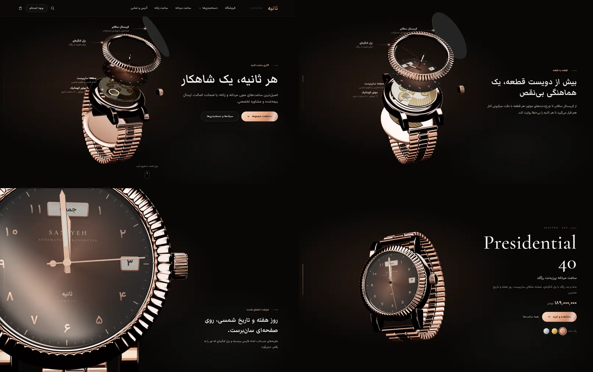
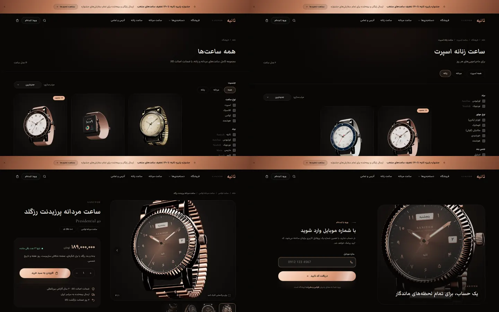
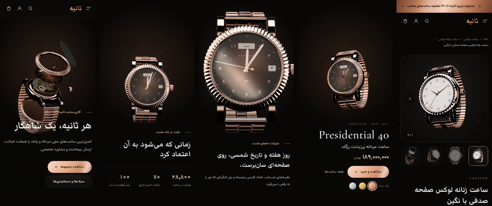
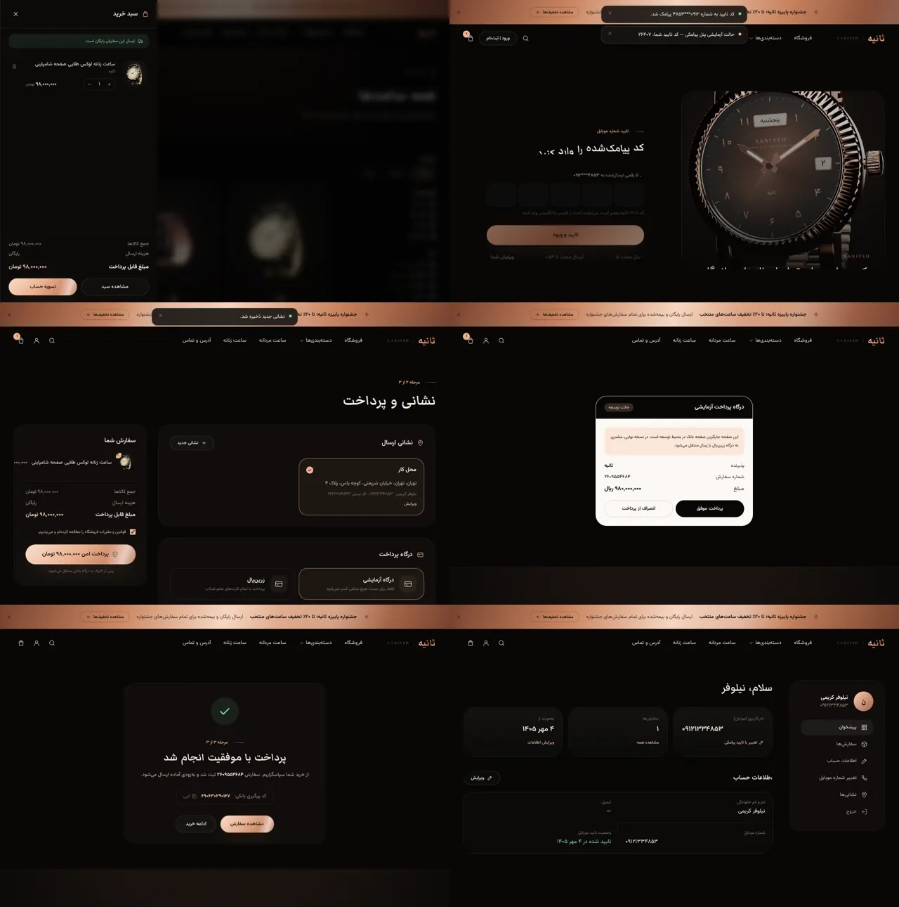
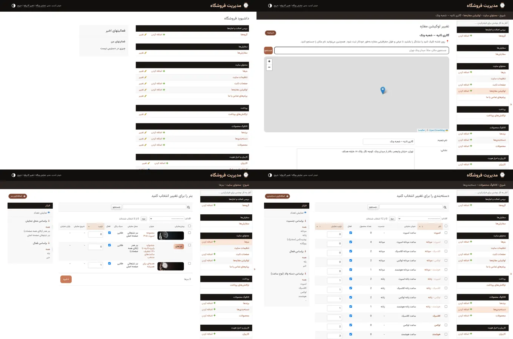
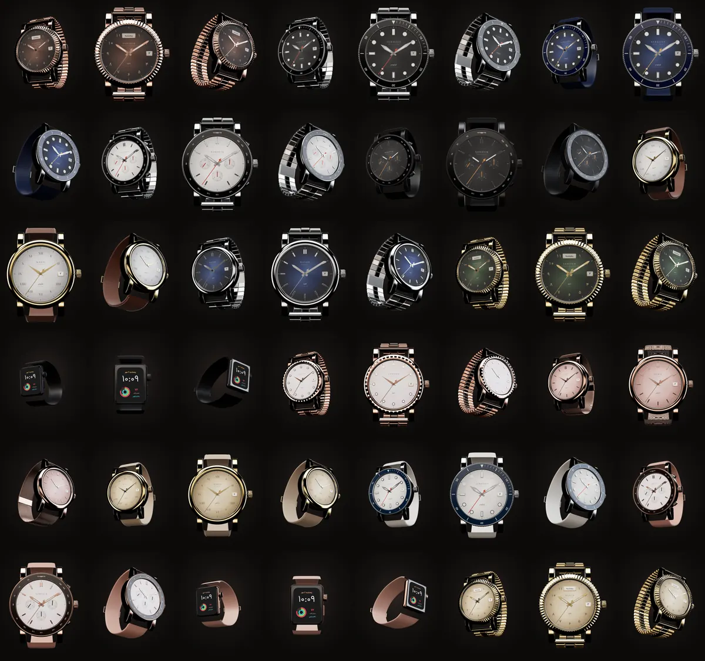

# فروشگاه آنلاین ساعت «ثانیه» — وب‌سایت اسکرول‌محور با Django

وب‌سایت فروشگاهی ساعت مچی با طراحی تیره و مینیمال و انیمیشن‌های اسکرول‌محور؛ مشابه ویدئوی مرجع، ساعت در ابتدای صفحه **قطعه‌قطعه (نمای انفجاری)** دیده می‌شود و با اسکرول کاربر، **قطعه به قطعه سرهم می‌شود**، می‌چرخد، روی صفحه ساعت زوم می‌کند و در پایان محصول معرفی می‌شود.

**فناوری‌ها:** HTML · CSS · Tailwind CSS 4 · JavaScript (three.js برای ساعت سه‌بعدی، Lenis برای اسکرول نرم، Leaflet برای نقشه) · Django 5.2



> ساعت سه‌بعدی به‌صورت کدنویسی‌شده (procedural) ساخته شده و به هیچ فایل مدل یا ویدئوی خارجی نیاز ندارد. روی صفحه آن **روز هفته به فارسی و تاریخ شمسی همان روز** نمایش داده می‌شود و عقربه‌ها ساعت واقعی را نشان می‌دهند.

---

## امکانات درخواستی و محل پیاده‌سازی

| # | امکان | توضیح |
|---|---|---|
| ۱ | **بنر زیبا در هدر** | از «پنل مدیریت › محتوای سایت › بنرها». بنر هدر در بالای همه صفحات نمایش داده می‌شود؛ با تصویر جداگانه برای موبایل، متن و دکمه، زمان‌بندی شروع/پایان، چرخش خودکار چند بنر و امکان بستن توسط کاربر. بدون تصویر هم یک بنر متنی طلایی ساخته می‌شود. بنرهای «صفحه اصلی» هم برای کمپین‌ها وجود دارد. |
| ۲ | **پروفایل کاربری با شماره تلفن** | ورود/ثبت‌نام فقط با موبایل و کد تایید پیامکی (OTP)؛ اولین ورود، پروفایل را می‌سازد. صفحه پروفایل شامل اطلاعات حساب، سفارش‌ها و نشانی‌هاست. |
| ۳ | **ویرایش نام کاربری (شماره تلفن) پس از تایید پیامکی** | «حساب کاربری › تغییر شماره موبایل»: کد به شماره **جدید** پیامک می‌شود و فقط پس از تایید، نام کاربری تغییر می‌کند (بدون خروج از حساب). |
| ۴ | **لوکیشن مغازه** | «پنل مدیریت › لوکیشن مغازه‌ها» با **نقشه تعاملی**: روی نقشه کلیک کنید یا نشانگر را بکشید (جستجوی نام مکان هم دارد). در سایت نقشه تیره، نشانی، ساعات کاری و دکمه‌های مسیریابی با **نشان، بلد، گوگل‌مپ و ویز** نمایش داده می‌شود. چند شعبه هم پشتیبانی می‌شود. |
| ۵ | **شبکه‌های اجتماعی در فوتر** | تلگرام، اینستاگرام، واتساپ، توییتر (ایکس) و **شماره تماس** از «تنظیمات سایت». کافی است نام کاربری یا لینک را وارد کنید. ایتا، بله و روبیکا هم به‌صورت اختیاری. |
| ۶ | **چند عکس برای هر محصول + اسکرول دستی** | در فرم محصول می‌توانید **چند تصویر را یکجا** انتخاب کنید و ترتیبشان را تعیین کنید. در سایت، گالری با کشیدن انگشت/ماوس، فلش‌ها، تصاویر کوچک و نمایش تمام‌صفحه جابه‌جا می‌شود؛ کارت‌های محصول هم اسلایدر دستی عکس دارند. تصاویر به‌طور خودکار بهینه (WebP) و در اندازه‌های مختلف ساخته می‌شوند. |
| ۷ | **دسته‌بندی نوع ساعت › زنانه/مردانه** | دسته‌بندی دوسطحی: ابتدا نوع ساعت (مثلاً اسپرت) و زیر آن زنانه و مردانه. با ساخت یک نوع جدید، زیرشاخه‌های «مردانه» و «زنانه» خودکار ساخته می‌شوند. عنوان‌ها به شکل «ساعت زنانه اسپرت» و آدرس‌ها مثل `/category/sport/women/` هستند. صفحات کلی «ساعت مردانه» و «ساعت زنانه» هم وجود دارد. |
| ۸ | **انتخاب دسته‌بندی هنگام افزودن محصول** | فهرست کشویی گروه‌بندی‌شده: «اسپرت ← ساعت مردانه اسپرت / ساعت زنانه اسپرت» و... |
| ۹ | **افزودن برند و انتخاب برند** | مدیریت برندها (نام فارسی/لاتین، لوگو، کشور). هنگام افزودن محصول، برند با جستجو انتخاب می‌شود و با دکمه **+** می‌توانید همان‌جا برند جدید بسازید که خودکار انتخاب می‌شود. |
| ۱۰ | **مقدمات درگاه پرداخت** | سبد خرید، تسویه‌حساب، سفارش و تراکنش؛ درگاه‌های **زرین‌پال** (API نسخه ۴ + سندباکس) و **زیبال**، به‌همراه **درگاه آزمایشی** برای توسعه. تایید تراکنش سمت سرور انجام می‌شود، مبلغ کنترل می‌شود و پردازش تکراری رخ نمی‌دهد؛ موجودی انبار پس از پرداخت موفق کم می‌شود. |
| ۱۱ | **جایگاه اینماد در فوتر** | کد دریافتی از enamad.ir را در «تنظیمات سایت › نماد اعتماد الکترونیکی» قرار دهید. تا وقتی کد وارد نشده، جایگاه آن فقط برای مدیر نمایش داده می‌شود. نشان ساماندهی هم پشتیبانی می‌شود. |

### امکانات تکمیلی
- انیمیشن‌های اسکرول: متن‌های مرحله‌ای کنار ساعت سه‌بعدی، نمایش کلمه‌به‌کلمه تیترها، جمله‌ای که با اسکرول روشن می‌شود، ردیف افقی دسته‌بندی‌ها، نوار برندها با سرعت وابسته به اسکرول و پارالاکس.
- کاربر می‌تواند رنگ بدنه ساعت سه‌بعدی (رزگلد، طلایی، استیل) را در پایان انیمیشن عوض کند؛ رنگ پیش‌فرض بدنه و صفحه از پنل مدیریت قابل تنظیم است.
- اعداد فارسی، قیمت به تومان با جداکننده، تاریخ‌های شمسی و فونت‌های فارسی میزبانی‌شده روی خود سرور (بدون وابستگی به CDN خارجی).
- جستجوی زنده با پیشنهاد محصول/دسته/برند (با یکسان‌سازی «ي/ك» عربی)، فیلتر بر اساس جنسیت، نوع، برند، موتور، جنس بند، قیمت، موجودی و تخفیف، و مرتب‌سازی.
- سبد خرید کشویی بدون بارگذاری مجدد صفحه، پیشرفت تا ارسال رایگان، مدیریت چند نشانی.
- واکنش‌گرا برای موبایل، سازگار با `prefers-reduced-motion` و نسخه جایگزین (تصویر) برای مرورگرهای بدون WebGL.
- سئو: متا تگ‌ها، Open Graph، داده ساختاریافته محصول (JSON-LD)، `sitemap.xml` و `robots.txt`.
- صفحات ثابت (درباره ما، قوانین، شیوه ارسال، گارانتی) و فرم تماس با ما.




---

## اجرای سریع (محیط توسعه)

پیش‌نیاز: Python 3.10 یا بالاتر.

```bash
cd watch-shop
python -m venv .venv
source .venv/bin/activate          # ویندوز: .venv\Scripts\activate
pip install -r requirements.txt
cp .env.example .env               # ویندوز: copy .env.example .env
python manage.py migrate
python manage.py seed_demo --with-admin
python manage.py runserver
```

- سایت: <http://127.0.0.1:8000>
- پنل مدیریت: <http://127.0.0.1:8000/admin/> — شماره `09120000000` و رمز `admin12345` (حتماً تغییر دهید).
- در حالت توسعه پیامک واقعی ارسال نمی‌شود؛ **کد تایید در پیام بالای صفحه و در کنسول سرور** نمایش داده می‌شود.
- برای تست خرید، «درگاه آزمایشی» را انتخاب کنید؛ هیچ مبلغی کسر نمی‌شود.

فایل‌های CSS و JavaScript از قبل ساخته شده‌اند؛ برای اجرای سایت به Node.js نیازی نیست.

---

## اتصال پنل پیامکی

در فایل `.env` مقدار `SMS_BACKEND` را تنظیم کنید. در ایران ارسال کد تایید فقط با **الگوی (Pattern) تاییدشده** انجام می‌شود؛ ابتدا در پنل خود یک الگو با یک متغیر برای کد بسازید.

| پنل | تنظیمات |
|---|---|
| کاوه‌نگار | `SMS_BACKEND=kavenegar`، `KAVENEGAR_API_KEY`، `KAVENEGAR_OTP_TEMPLATE` (نام الگو؛ متغیر `%token`) |
| SMS.ir | `SMS_BACKEND=smsir`، `SMSIR_API_KEY`، `SMSIR_OTP_TEMPLATE_ID`، `SMSIR_OTP_PARAM_NAME` (نام متغیر الگو، پیش‌فرض `CODE`) |
| ملی‌پیامک | `SMS_BACKEND=melipayamak`، `MELIPAYAMAK_USERNAME`، `MELIPAYAMAK_PASSWORD`، `MELIPAYAMAK_OTP_BODY_ID` |

برای پنل‌های دیگر کافی است یک کلاس از `accounts.sms.BaseSMSBackend` بسازید و مسیر آن را در `SMS_BACKEND` قرار دهید. امنیت کد تایید: کدها به‌صورت هش ذخیره می‌شوند، ۲ دقیقه اعتبار دارند، حداکثر ۵ بار تلاش مجاز است و ارسال مجدد با فاصله ۶۰ ثانیه و سقف ساعتی برای هر شماره و هر IP محدود شده است (همه قابل تنظیم).

## اتصال درگاه پرداخت

```env
PAYMENT_GATEWAYS=zarinpal,zibal     # اولی درگاه پیش‌فرض است
ZARINPAL_MERCHANT_ID=xxxxxxxx-xxxx-xxxx-xxxx-xxxxxxxxxxxx
ZARINPAL_SANDBOX=False              # برای تست: True
ZIBAL_MERCHANT=your-merchant        # مقدار zibal حالت تست زیبال است
SITE_URL=https://your-domain.ir      # برای ساخت آدرس بازگشت از بانک
PAYMENT_ALLOW_FAKE=False             # درگاه آزمایشی در سایت اصلی خاموش باشد
```

مبالغ در سایت به **تومان** نمایش داده و به درگاه به **ریال** ارسال می‌شوند. آدرس بازگشت هر درگاه `/payment/callback/<نام درگاه>/` است. برای افزودن درگاه‌های بانکی دیگر، کلاسی از `payments.gateways.BaseGateway` بسازید و در `GATEWAY_CLASSES` ثبت کنید.



---

## راهنمای پنل مدیریت

| بخش | کاربرد |
|---|---|
| محتوای سایت › تنظیمات سایت | نام و لوگو، متن‌های بخش سه‌بعدی و محصول معرفی‌شده در آن، رنگ ساعت سه‌بعدی، تلفن و شبکه‌های اجتماعی، **کد اینماد**، هزینه ارسال |
| محتوای سایت › بنرها | بنر هدر و بنرهای صفحه اصلی |
| محتوای سایت › لوکیشن مغازه‌ها | ثبت شعبه‌ها روی نقشه |
| کاتالوگ › دسته‌بندی‌ها | نوع ساعت و زیرشاخه‌های مردانه/زنانه |
| کاتالوگ › برندها / محصولات | افزودن برند و محصول با چند تصویر و مشخصات فنی |
| سفارش‌ها / تراکنش‌های پرداخت | پیگیری سفارش، تغییر وضعیت و ثبت کد رهگیری مرسوله |
| کاربران | مشتریان (بدون رمز، ورود پیامکی) و مدیران (با رمز) |



---

## توسعه فرانت‌اند

منابع در پوشه `frontend/` هستند و خروجی ساخته‌شده در `static/` قرار می‌گیرد.

```bash
npm install
npm run build        # فونت‌ها + Tailwind + باندل JavaScript
npm run watch:css    # در حین توسعه
npm run watch:js
```

- `frontend/css/app.css` — طراحی با Tailwind CSS 4 (رنگ‌ها، فونت‌ها، کامپوننت‌ها و انیمیشن‌ها)
- `frontend/js/app.js` — اسکرول نرم، انیمیشن‌های اسکرول، هدر، گالری‌ها، سبد خرید، کد تایید، نقشه
- `frontend/js/hero.js` — کارگردانی انیمیشن سه‌بعدی بر اساس درصد اسکرول (فریم‌های کلیدی `KEYS_WIDE` و `KEYS_NARROW`)
- `frontend/js/watch/` — ساخت کدنویسی‌شده ساعت: بدنه، بزل کنگره‌ای، صفحه، عقربه‌ها، موتور و چرخ‌دنده‌ها، بند و مدل‌های اسپرت، کرنوگراف، کلاسیک و هوشمند

تصاویر محصولات نمونه (`seed/images`) با همین مدل سه‌بعدی رندر شده‌اند.



---

## استقرار روی سرور

1. در `.env`: `DEBUG=False`، یک `SECRET_KEY` طولانی و تصادفی، `ALLOWED_HOSTS`، `CSRF_TRUSTED_ORIGINS` و `SITE_URL`.
2. `python manage.py migrate` و `python manage.py collectstatic --noinput` (فایل‌های استاتیک با WhiteNoise و فشرده سرو می‌شوند). پس از افزودن تعداد زیادی محصول، `python manage.py warm_thumbnails` تصاویر کوچک را از قبل می‌سازد.
3. اجرا: `gunicorn config.wsgi:application --bind 0.0.0.0:8000`
4. فایل‌های آپلودی (`media/`) را با nginx سرو کنید؛ اگر وب‌سرور جداگانه ندارید (مثلاً روی سرویس‌های PaaS)، `SERVE_MEDIA=True` قرار دهید.
5. برای PostgreSQL: `DB_ENGINE=postgres` و متغیرهای `DB_*` و نصب `psycopg[binary]`.
6. تنظیمات پنل پیامکی و درگاه پرداخت واقعی و `PAYMENT_ALLOW_FAKE=False`.

نقشه به‌صورت پیش‌فرض از کاشی‌های OpenStreetMap استفاده می‌کند و با `MAP_TILE_URL` قابل تغییر است.

---

## ساختار پروژه

```
watch-shop/
├── config/        تنظیمات و آدرس‌های اصلی Django
├── core/          تنظیمات سایت، بنرها، لوکیشن، صفحات ثابت، صفحه اصلی، تگ‌های قالب
├── accounts/      کاربر با شماره موبایل، کد تایید پیامکی، پنل‌های پیامکی، پروفایل و نشانی‌ها
├── catalog/       برند، دسته‌بندی دوسطحی، محصول، تصاویر و جستجو/فیلتر
├── cart/          سبد خرید مبتنی بر سشن
├── orders/        تسویه‌حساب و سفارش‌ها
├── payments/      درگاه‌های زرین‌پال، زیبال و آزمایشی
├── templates/     قالب‌های HTML (راست‌چین)
├── frontend/      منبع CSS و JavaScript
├── static/        خروجی ساخته‌شده، فونت‌ها و کتابخانه‌ها
└── seed/          تصاویر داده‌های نمونه
```

## تست‌ها

```bash
python manage.py test
```

۶۰ تست خودکار شامل: ورود و ثبت‌نام پیامکی، تغییر شماره موبایل، ساختار دسته‌بندی و فرم افزودن محصول، فیلترها و جستجو، سبد خرید، خرید کامل با درگاه آزمایشی، زرین‌پال و زیبال (با پاسخ شبیه‌سازی‌شده)، جلوگیری از پردازش تکراری پرداخت و نمایش فوتر، بنر و اینماد.

## نکته درباره داده‌های نمونه

نام برندها، محصولات، نشانی‌ها و شبکه‌های اجتماعی داده‌های نمونه، **فرضی** هستند و فقط برای نمایش ساخته شده‌اند؛ پیش از راه‌اندازی آن‌ها را از پنل مدیریت با اطلاعات واقعی فروشگاه جایگزین کنید.
